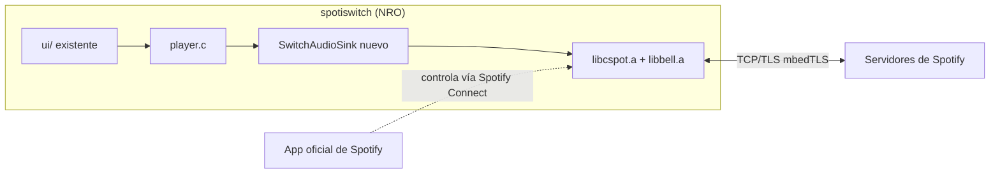

# Integración de Spotify en spotiswitch

Plan de trabajo para agregar un cliente/receptor de Spotify Connect real a la
app, reemplazando la librería mock (`source/data/mock_data.c`).

## Decisión de arquitectura

Se evaluaron 3 opciones iniciales (librespot-golang, TinyGo `nintendoswitch`,
librespot en Rust) y las 3 se descartaron: el ABI/runtime de devkitPro-libnx-C,
el backend custom de TinyGo, y el `std` de Rust son entornos mutuamente
incompatibles — ninguno se puede linkear dentro del NRO actual.

**Elegido: [cspot](https://github.com/feelfreelinux/cspot)**, cliente de
Spotify Connect en C++ pensado para embebidos (ESP32) pero portable. Encaja
con el toolchain devkitA64/libnx que ya usa este proyecto.

Arquitectura resultante:



- **cspot/bell** resuelven todo el protocolo (ApResolve, handshake Shannon +
  Diffie-Hellman, sesión, Mercury, Spirc/Connect state, decodificación de
  Vorbis/Opus/AAC/MP3 a PCM).
- Nuestra app solo implementa un `AudioSink` (recibe PCM 44.1kHz/16-bit
  estéreo) y engancha los controles de Joy-Con al estado de reproducción.
- Fase de autenticación: login usuario/contraseña (cachear el auth blob),
  zeroconf/mDNS queda para después (ver research en memoria de repo).
- Fase futura (no empezada): cliente de la Web API de Spotify (búsqueda/
  navegación) usando OAuth Authorization Code + PKCE — ver notas de research.

## Fases

1. **[EN CURSO] Motor de reproducción (cspot)** — hacer que cspot/bell
   compilen para el target Switch, escribir el shim de plataforma que falta,
   escribir el `AudioSink`, linkear todo dentro del Makefile existente y
   lograr reproducir un track de prueba.
2. **Autenticación** — login usuario/contraseña con teclado en pantalla
   (`swkbd`), cachear el auth blob en la SD.
3. **(Futuro) Cliente Web API** — búsqueda/navegación + control de la propia
   sesión Connect vía `PUT /v1/me/player/play?device_id=...`.

## Estado actual — Fase 1

### Hecho

- Repo inicializado con git (no lo tenía) y commit inicial del estado previo.
- `cspot` vendorizado como submódulo git en `external/cspot` (con sus propios
  submódulos: `bell`, `mdnssvc`, `nlohmann_json`, `nanopb`, `opus`,
  `opencore-aacdec`, `tremor`, `cJSON`, `civetweb`, `mqtt`, `portaudio`,
  `alac`, `fmt`).
- Entorno de build preparado en esta Mac:
  - `cmake` instalado vía Homebrew (no estaba).
  - `switch-mbedtls` instalado vía `dkp-pacman` (portlib requerido por bell).
  - Venv de Python en `.venv-tools/` con `protobuf` + `grpcio-tools` +
    `setuptools<81` (necesario para que `pkg_resources`, deprecado, siga
    existiendo — lo usa el generador de nanopb) para la generación de código
    de protobuf/nanopb (esto corre solo en la Mac, nunca en la Switch).
- **`libcspot.a` y `libbell.a` compilan y linkean con éxito para
  aarch64/devkitA64 usando el toolchain `/opt/devkitpro/cmake/Switch.cmake`.**
  Esto incluye TODO lo difícil: sesión Spotify, cifrado Shannon, TLS
  (mbedTLS), sockets, HTTP client, y los decoders de Vorbis/Opus/AAC/MP3.
- 4 parches mínimos necesarios (documentados también en la memoria de repo):
  1. `external/cspot/cspot/bell/external/libhelix-mp3/mp3dec.h` — agregar
     `#elif defined(__aarch64__)` al chequeo de plataforma (no-op, solo
     desbloquea la compilación).
  2. `external/cspot/cspot/bell/external/libhelix-mp3/assembly.h` — agregar
     `defined(__aarch64__)` a la rama de fallback en C portable (sin
     assembly) que ya usan Apple/ESP32/amd64.
  3. `external/cspot/cspot/bell/external/nanopb/generator/nanopb_generator.py`
     — `reflection.MakeClass` fue removido en protobuf moderno; se agregó un
     fallback a `message_factory.GetMessageClass`.
  4. `external/cspot/cspot/src/PlainConnection.cpp` — faltaba
     `#include <arpa/inet.h>` para `htonl`/`ntohl`.

  Nota: los parches 1-3 son a submódulos vendorizados (no a nuestro código) —
  viven como cambios locales sin commitear en `external/cspot` por ahora.
  Habría que evaluar más adelante si forkeamos `cspot`/`bell` para
  persistirlos limpiamente.

### Cómo reproducir el build

```sh
source .venv-tools/bin/activate   # provee protobuf/grpcio-tools al build
cmake -S external/cspot/cspot -B build-cspot-switch \
  -DCMAKE_TOOLCHAIN_FILE=/opt/devkitpro/cmake/Switch.cmake \
  -DBELL_DISABLE_MQTT=ON -DBELL_DISABLE_WEBSERVER=ON \
  -DCMAKE_POLICY_VERSION_MINIMUM=3.5
cmake --build build-cspot-switch -j8
```

Produce `build-cspot-switch/libcspot.a` y `build-cspot-switch/bell/libbell.a`.

- **Shim de plataforma `switch` para bell escrito y funcionando**:
  `WrappedSemaphore` (libnx NO implementa `sem_init`/`sem_wait` de POSIX pese
  a tener el header — hubo que escribirlo a mano sobre `Mutex`+`CondVar`
  nativos de libnx). `MDNSService` confirmado innecesario por ahora (solo lo
  usa el flujo de Zeroconf pairing, que no vamos a implementar todavía).
- **Prueba de linkeo end-to-end exitosa**: proyecto descartable en
  `linktest/` arma una sesión real (`LoginBlob → Context → SpircHandler`) y
  **linkea sin errores** para aarch64/devkitA64. Este era el riesgo técnico
  más grande de todo el proyecto y ya está confirmado:
  ```sh
  source .venv-tools/bin/activate
  cmake -S linktest -B build-linktest -DCMAKE_TOOLCHAIN_FILE=/opt/devkitpro/cmake/Switch.cmake -DCMAKE_POLICY_VERSION_MINIMUM=3.5
  cmake --build build-linktest -j8
  ```

### Falta (próximos pasos, en orden)

1. ~~Escribir el shim de plataforma "switch" para bell~~ **HECHO** —
   `WrappedSemaphore` implementado sobre `Mutex`+`CondVar` nativos de libnx
   (libnx NO tiene una implementación real de `sem_init`/`sem_wait` de POSIX
   pese a que el header existe — hubo que escribir la sincronización a mano).
   `MDNSService` se confirmó opcional: solo lo usa `ZeroconfAuthenticator` en
   el target CLI de cspot, no el núcleo (`SpircHandler`/`Session`/etc.), así
   que no hace falta todavía (login usuario/contraseña no lo requiere).
2. ~~Prueba de linkeo end-to-end~~ **HECHO** — proyecto CMake descartable en
   `linktest/` que arma `LoginBlob → Context → SpircHandler` (esto arrastra
   TrackPlayer/TrackQueue/CDNAudioFile/MercurySession/Shannon/mbedTLS/
   sockets) y **linkea sin errores** (`linktest.elf`). Este es el riesgo
   técnico más grande del proyecto y ya está confirmado que funciona.
3. Escribir `SwitchAudioSink` real (hoy es un stub en `linktest/main.cpp`)
   usando SDL2 (`SDL_QueueAudio`), ya que el proyecto ya usa SDL2 para todo
   lo demás.
4. Mover la integración del proyecto descartable `linktest/` al Makefile
   real (`source/`), sumando `libcspot.a`/`libbell.a`/libs de códecs a
   `LIBS`/`LIBPATHS`, para producir un `.nro` real (no solo un `.elf` de
   prueba).
5. Implementar login usuario/contraseña con `swkbd` + cache del auth blob en
   la SD, y un flujo mínimo de prueba (reproducir algo real desde el celular
   con la Switch como dispositivo Connect).
6. Enganchar los controles existentes (Joy-Con / mini-player) al estado real
   de reproducción en vez del mock.

