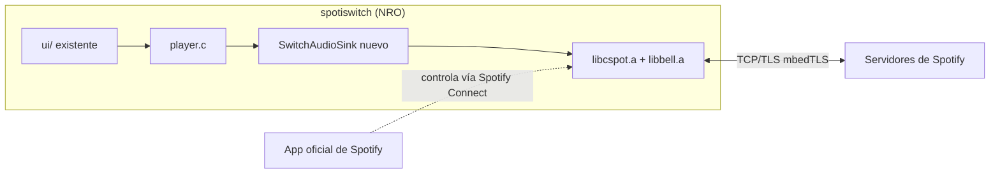

# Integración de Spotify en spotiswitch

Plan de trabajo para agregar un cliente/receptor de Spotify Connect real a la
app, reemplazando la librería mock (`source/data/mock_data.c`).

## Decisión de arquitectura

Se evaluaron 3 opciones iniciales (librespot-golang, TinyGo `nintendoswitch`,
librespot en Rust) y las 3 se descartaron: el ABI/runtime de devkitPro-libnx-C,
el backend custom de TinyGo, y el `std` de Rust son entornos mutuamente
incompatibles — ninguno se puede linkear dentro del NRO actual.

**Elegido: [cspot](https://github.com/feelfreelinux/cspot)**, cliente de
Spotify Connect en C++ pensado para embebidos (ESP32) pero portable. Encaja
con el toolchain devkitA64/libnx que ya usa este proyecto.

Arquitectura resultante:



- **cspot/bell** resuelven todo el protocolo (ApResolve, handshake Shannon +
  Diffie-Hellman, sesión, Mercury, Spirc/Connect state, decodificación de
  Vorbis/Opus/AAC/MP3 a PCM).
- Nuestra app solo implementa un `AudioSink` (recibe PCM 44.1kHz/16-bit
  estéreo) y engancha los controles de Joy-Con al estado de reproducción.
- Fase de autenticación: login usuario/contraseña (cachear el auth blob),
  zeroconf/mDNS queda para después (ver research en memoria de repo).
- Fase futura (no empezada): cliente de la Web API de Spotify (búsqueda/
  navegación) usando OAuth Authorization Code + PKCE — ver notas de research.

## Fases

1. **[EN CURSO] Motor de reproducción (cspot)** — hacer que cspot/bell
   compilen para el target Switch, escribir el shim de plataforma que falta,
   escribir el `AudioSink`, linkear todo dentro del Makefile existente y
   lograr reproducir un track de prueba.
2. **Autenticación** — login usuario/contraseña con teclado en pantalla
   (`swkbd`), cachear el auth blob en la SD.
3. **(Futuro) Cliente Web API** — búsqueda/navegación + control de la propia
   sesión Connect vía `PUT /v1/me/player/play?device_id=...`.

## Estado actual — Fase 1

### Hecho

- Repo inicializado con git (no lo tenía) y commit inicial del estado previo.
- `cspot` vendorizado como submódulo git en `external/cspot` (con sus propios
  submódulos: `bell`, `mdnssvc`, `nlohmann_json`, `nanopb`, `opus`,
  `opencore-aacdec`, `tremor`, `cJSON`, `civetweb`, `mqtt`, `portaudio`,
  `alac`, `fmt`).
- Entorno de build preparado en esta Mac:
  - `cmake` instalado vía Homebrew (no estaba).
  - `switch-mbedtls` instalado vía `dkp-pacman` (portlib requerido por bell).
  - Venv de Python en `.venv-tools/` con `protobuf` + `grpcio-tools` +
    `setuptools<81` (necesario para que `pkg_resources`, deprecado, siga
    existiendo — lo usa el generador de nanopb) para la generación de código
    de protobuf/nanopb (esto corre solo en la Mac, nunca en la Switch).
- **`libcspot.a` y `libbell.a` compilan y linkean con éxito para
  aarch64/devkitA64 usando el toolchain `/opt/devkitpro/cmake/Switch.cmake`.**
  Esto incluye TODO lo difícil: sesión Spotify, cifrado Shannon, TLS
  (mbedTLS), sockets, HTTP client, y los decoders de Vorbis/Opus/AAC/MP3.
- 4 parches mínimos necesarios (documentados también en la memoria de repo):
  1. `external/cspot/cspot/bell/external/libhelix-mp3/mp3dec.h` — agregar
     `#elif defined(__aarch64__)` al chequeo de plataforma (no-op, solo
     desbloquea la compilación).
  2. `external/cspot/cspot/bell/external/libhelix-mp3/assembly.h` — agregar
     `defined(__aarch64__)` a la rama de fallback en C portable (sin
     assembly) que ya usan Apple/ESP32/amd64.
  3. `external/cspot/cspot/bell/external/nanopb/generator/nanopb_generator.py`
     — `reflection.MakeClass` fue removido en protobuf moderno; se agregó un
     fallback a `message_factory.GetMessageClass`.
  4. `external/cspot/cspot/src/PlainConnection.cpp` — faltaba
     `#include <arpa/inet.h>` para `htonl`/`ntohl`.

  Nota: los parches 1-3 son a submódulos vendorizados (no a nuestro código) —
  viven como cambios locales sin commitear en `external/cspot` por ahora.
  Habría que evaluar más adelante si forkeamos `cspot`/`bell` para
  persistirlos limpiamente.

### Cómo reproducir el build

```sh
source .venv-tools/bin/activate   # provee protobuf/grpcio-tools al build
cmake -S external/cspot/cspot -B build-cspot-switch \
  -DCMAKE_TOOLCHAIN_FILE=/opt/devkitpro/cmake/Switch.cmake \
  -DBELL_DISABLE_MQTT=ON -DBELL_DISABLE_WEBSERVER=ON \
  -DCMAKE_POLICY_VERSION_MINIMUM=3.5
cmake --build build-cspot-switch -j8
```

Produce `build-cspot-switch/libcspot.a` y `build-cspot-switch/bell/libbell.a`.

- **Shim de plataforma `switch` para bell escrito y funcionando**:
  `WrappedSemaphore` (libnx NO implementa `sem_init`/`sem_wait` de POSIX pese
  a tener el header — hubo que escribirlo a mano sobre `Mutex`+`CondVar`
  nativos de libnx). `MDNSService` confirmado innecesario por ahora (solo lo
  usa el flujo de Zeroconf pairing, que no vamos a implementar todavía).
- **Prueba de linkeo end-to-end exitosa**: proyecto descartable en
  `linktest/` arma una sesión real (`LoginBlob → Context → SpircHandler`) y
  **linkea sin errores** para aarch64/devkitA64. Este era el riesgo técnico
  más grande de todo el proyecto y ya está confirmado:
  ```sh
  source .venv-tools/bin/activate
  cmake -S linktest -B build-linktest -DCMAKE_TOOLCHAIN_FILE=/opt/devkitpro/cmake/Switch.cmake -DCMAKE_POLICY_VERSION_MINIMUM=3.5
  cmake --build build-linktest -j8
  ```

### Falta (próximos pasos, en orden)

1. ~~Escribir el shim de plataforma "switch" para bell~~ **HECHO** —
   `WrappedSemaphore` implementado sobre `Mutex`+`CondVar` nativos de libnx
   (libnx NO tiene una implementación real de `sem_init`/`sem_wait` de POSIX
   pese a que el header existe — hubo que escribir la sincronización a mano).
   `MDNSService` se confirmó opcional: solo lo usa `ZeroconfAuthenticator` en
   el target CLI de cspot, no el núcleo (`SpircHandler`/`Session`/etc.), así
   que no hace falta todavía (login usuario/contraseña no lo requiere).
2. ~~Prueba de linkeo end-to-end~~ **HECHO** — proyecto CMake descartable en
   `linktest/` que arma `LoginBlob → Context → SpircHandler` (esto arrastra
   TrackPlayer/TrackQueue/CDNAudioFile/MercurySession/Shannon/mbedTLS/
   sockets) y **linkea sin errores** (`linktest.elf`). Este es el riesgo
   técnico más grande del proyecto y ya está confirmado que funciona.
3. ~~Escribir `SwitchAudioSink` real~~ **HECHO** — `source/spotify/SwitchAudioSink.{h,cpp}`,
   usa un `SDL_AudioDeviceID` propio (independiente del que abre
   `Mix_OpenAudio`) con `SDL_QueueAudio`, con backpressure simple (~2s de
   buffer máximo).
4. ~~Mover la integración al Makefile real~~ **HECHO** — `source/spotify/SpotifyClient.{h,cpp}`
   (login usuario/contraseña, sesión, hilos de red y de audio, todo
   modelado 1:1 sobre el target CLI oficial de cspot) + cambios en el
   `Makefile` raíz (ver más abajo) + `main.c` llama a `spotify_client_start()`
   al arrancar. **`make` genera un `spotiswitch.nro` real con todo
   incluido.**
5. Implementar login con `swkbd` (teclado en pantalla) + cache del auth blob
   en la SD — hoy el login lee usuario/contraseña de un archivo de texto
   plano en la SD (ver sección "Probarlo" abajo). Es un atajo deliberado para
   tener un prototipo cuanto antes; `swkbd` queda como mejora de UX.
6. Enganchar los controles existentes (Joy-Con / mini-player) al estado real
   de reproducción en vez del mock — hoy el mock (`mock_data.c`) y Spotify
   corren en paralelo, sin tocarse.

## Estado actual — Fase 1: COMPLETA (prototipo listo para probar)

### Cambios en el Makefile

- `SOURCES` ahora incluye `source/spotify`.
- Se agregó globbing de `.cpp` (`CPPFILES`), antes solo compilaba `.c`.
- `CXXFLAGS` ya no tiene `-fno-rtti -fno-exceptions` (cspot los necesita:
  `LoginBlob`, `nlohmann::json`, etc. usan excepciones) y suma `-std=gnu++20`
  + los `-I` de cspot/bell (nanopb, fmt, tremor, nlohmann_json, y los headers
  de protobuf generados en `build-cspot-switch/`).
- `LIBS` suma, al principio: `-lcspot -lbell -lopencore-aacdec -lopus
  -lmbedtls -lmbedx509 -lmbedcrypto`.
- `LIBPATHS` suma los 4 directorios de `build-cspot-switch/` (raíz,
  `bell/`, `bell/external/opus/`, `bell/external/opencore-aacdec/`).
- `LDFLAGS` suma `-Wl,--allow-multiple-definition`: bell vendoriza su propia
  copia de `libogg` (via tremor, para Vorbis de punto fijo) que duplica
  símbolos (`ogg_page_version`, etc.) con el portlib `-logg` que ya usaba el
  proyecto para reproducción local. Ambas copias son ABI-compatibles; el
  flag solo le dice al linker que se quede con la primera que encuentre.

**Importante**: antes de correr `make` en este proyecto hace falta tener
`build-cspot-switch/` ya compilado (ver comando más arriba) — el Makefile
NO dispara ese build por sí solo todavía (posible mejora futura: un target
`cspot-libs` que lo automatice).

### Arquitectura del código nuevo (`source/spotify/`)

- `SwitchAudioSink.{h,cpp}`: implementa `AudioSink::feedPCMFrames` con
  `SDL_QueueAudio` sobre un `SDL_AudioDeviceID` propio.
- `SpotifyClient.{h,cpp}`: API en C (`spotify_client_start()`,
  `spotify_client_get_now_playing()`) que por dentro arma, en espejo casi
  exacto del target CLI oficial de cspot (`targets/cli/main.cpp` +
  `CliPlayer.cpp`):
  - `LoginBlob` (usuario/contraseña) → `Context::createFromBlob` →
    `session->connectWithRandomAp()` → `session->authenticate()`.
  - `SpircHandler` + dos hilos propios (clases `bell::Task`):
    - `SessionPumpTask`: bombea `session->handlePacket()` en loop (el CLI
      oficial hace esto en el hilo principal con un `while` bloqueante; acá
      no podemos bloquear el hilo principal de SDL, así que va en su propio
      hilo).
    - `PlayerPumpTask`: bombea `CentralAudioBuffer` → `BellDSP` →
      `AudioSink`, réplica de `CliPlayer::runTask()`.
- `main.c` llama a `socketInitializeDefault()` + `nxlinkStdio()` (para poder
  ver los `printf` con `nxlink -s`) y luego `spotify_client_start()` justo
  después de abrir el audio, antes de crear la ventana. Si falla (por
  ejemplo no existe el archivo de credenciales), solo imprime un mensaje y
  el resto de la app sigue funcionando normal con la library mock.

### Cómo probarlo (falta hacer esto en hardware real)

1. En la SD de la Switch, crear `sdmc:/switch/spotiswitch/login.txt` con:
   ```
   tu_usuario_de_spotify
   tu_contraseña
   ```
   (dos líneas, sin comillas). Ojo: si tu cuenta usa login de
   Facebook/Google/Apple, hay que setear una contraseña "normal" desde la
   configuración de la cuenta de Spotify primero.
2. Copiar `spotiswitch.nro` a la SD (por ej. `sdmc:/switch/spotiswitch.nro`)
   y correrlo desde el homebrew menu, o con `nxlink -s spotiswitch.nro` para
   además ver los logs por red.
3. Si conecta bien, la Switch debería aparecer en el selector "Conectar a un
   dispositivo" de la app de Spotify en el celular/PC — elegirla y darle
   play a algo.
4. Cosas sin probar todavía / posibles puntos de falla en hardware real (no
   se pueden validar sin una Switch física):
   - Comportamiento real de `pthread_create`/hilos de libnx bajo carga
     (linkea bien, pero nunca se ejecutó).
   - Abrir dos `SDL_AudioDeviceID` simultáneos (uno de `Mix_OpenAudio`, otro
     del `SwitchAudioSink`) — no hay garantía de que el driver de audio de
     Switch en SDL2 soporte esto sin probarlo.
   - Permisos de red del homebrew (debería andar igual que cualquier NRO que
     hace requests HTTP, pero no está confirmado en este proyecto puntual).


